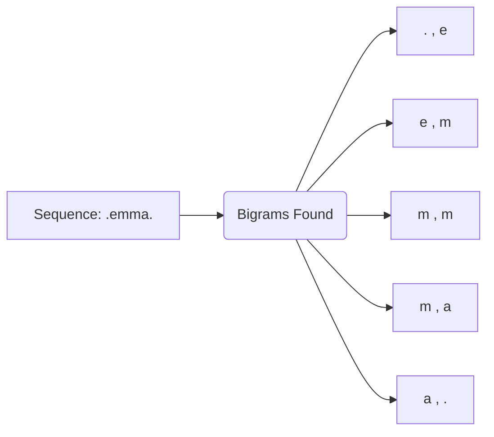

# 🔡 Bigram Language Model: Statistical Name Generation

A simple yet elegant character-level language model that uses **statistical bigram counts** to predict and generate new names. This project demonstrates the fundamental concepts of language modeling, probability distributions, and efficient tensor operations in PyTorch.

---

## 🚀 Project Overview

The Bigram Language Model is based on the **Markov Property**, which assumes that the probability of a character depends only on the immediate preceding character. By analyzing a dataset of over 32,000 names, the model builds a transition matrix that dictates the likelihood of character sequences.

### 📊 The Dataset
The model uses `names.txt`, a compilation of thousands of human names. 
- **Total Names**: ~32,000+
- **Vocabulary**: 26 lowercase English letters + special start (`<S>`) and end (`<E>`) tokens.

---

## 🛠️ How It Works

### 1. Tokenization & Mapping
We first convert every character into a unique integer index. 
- `a` → `1`, `b` → `2`, ..., `.` → `0`
- This allows us to perform mathematical operations on character data using tensors.

### 2. Frequency Counting
The model scans the entire dataset and counts how often each character follows another.

### 3. The Count Matrix (N)
A 27x27 matrix is constructed where each entry $(i, j)$ represents the number of times character index $j$ follows character index $i$.

### 4. Sampling
To generate a name, we start with the `.` token, look at its row in the probability matrix, and sample the next character based on the distribution. We repeat this until we hit another `.` token.

---

## 🧠 What I Learned

This project served as a deep dive into the building blocks of modern LLMs:

*   **Statistical Modeling**: Understanding how a simple count-based approach can capture surprisingly human-like patterns.
*   **PyTorch Fundamentals**: 
    *   Creating and manipulating **Tensors**.
    *   **Broadcasting**: Efficiently dividing count rows by their sums without using loops.
    *   **In-place operations**: Managing memory with operations like `+=`.
*   **Probability Distributions**: Normalizing counts to sum to 1.0 to create valid probability vectors.
*   **Visualization**: Using `matplotlib` to render the count matrix, making the "patterns" of the English language visible.
*   **Log-Likelihood**: Learned that evaluation is done by calculating the **Negative Log Likelihood (NLL)**. A lower NLL means the model is better at predicting the training data.

---

## ⚠️ Limitations

While an excellent educational tool, the Bigram model has significant constraints:
> [!WARNING]
> **Context Window**: The model only looks at **one** previous character. It doesn't "remember" that it just typed 'Ma' when deciding what comes after 'a'.
> **Data Sparsity**: Many bigrams never appear in the training data (e.g., 'q' followed by 'x'). These get 0% probability unless **Model Smoothing** (adding a fake count) is applied.
> **Lack of Complexity**: It cannot capture long-range dependencies or complex semantic structures found in neural network-based models (like Transformers).

---

## 📺 Credits

This implementation was inspired by the excellent "Makemore" series by **Andrej Karpathy**. It serves as a foundational step toward understanding more complex architectures like Multi-Layer Perceptrons (MLPs) and Transformers.

---

### 🛠️ Tech Stack

